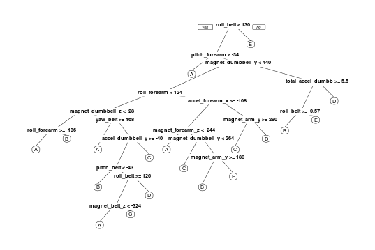

# Coursera-practical-machine-learning
# Introduction

Using devices such as Jawbone Up, Nike FuelBand, and Fitbit it is now possible to collect a large amount of data about
personal activity relatively inexpensively. These type of devices are part of the quantified self movement –
a group of enthusiasts who take measurements about themselves regularly to improve their health, to find patterns
in their behavior, or because they are tech geeks. One thing that people regularly do is quantify how much of a particular 
activity they do, but they rarely quantify how well they do it. In this project, your goal will be to use data from 
accelerometers on the belt, forearm, arm, and dumbell of 6 participants. They were asked to perform barbell lifts correctly 
and incorrectly in 5 different ways. 
More information is available from the website here: http://web.archive.org/web/20161224072740/http:/groupware.les.inf.puc-rio.br/har (see the section on the Weight Lifting Exercise Dataset).


# Data

The training data for this project are available here:

https://d396qusza40orc.cloudfront.net/predmachlearn/pml-training.csv

The test data are available here:

https://d396qusza40orc.cloudfront.net/predmachlearn/pml-testing.csv

# R packages
```{r, message=FALSE}
library(caret)
library(rpart)
library(rpart.plot)
library(randomForest)
library(corrplot)

```
# Reading data
In order to read cv file we use the read.csv 
```{r, message=FALSE}
train <- read.csv("./data/pml-training.csv")
test <- read.csv("./data/pml-testing.csv")
dim(train)
dim(test)
names(train)
```
After executing the dim command we find that The training data set contains 19622 observations and 160 variables, 
while the testing data set contains 20 observations and 160 variables.And there is a variable "classe" 
with Levels: A B C D E which is the outcome to predict
# Cleaning data
In this step, we will clean the data.
We first remove incomplete columns with missing values (Na)
```{r, message=FALSE}
train <- train[, colSums(is.na(train)) == 0] 
test <- test[, colSums(is.na(test)) == 0] 
```
Remove features that are related to the time-series or are not numeric.
```{r, message=FALSE}
classe <- train$classe
trainToRemove <- grepl("^X|timestamp|window", names(train))
train <- train[, !trainToRemove]
train <- train[, sapply(train, is.numeric)]
train$classe <- classe
testToRemove <- grepl("^X|timestamp|window", names(test))
test <- test[, !testToRemove]
test <- test[, sapply(test, is.numeric)]
dim(train)
dim(test)
```
Now, the cleaned training data set contains 19622 observations and 53 variables, while the testing data set contains 20 observations and 53 variables.
# Partitioning the Dataset
We will split our data into a training data set (70% of the total cases) and a testing data set (30% of the total cases).
We will use the test data set to conduct cross validation in future steps.
```{r, message=FALSE}
set.seed(12345)
inTrain <- createDataPartition(train$classe, p=0.7, list=FALSE)
training <- train[inTrain,]
testing <- train[-inTrain,]
dim(training); dim(testing);
```
# Building the Random Forest Model
We fit a predictive model for activity recognition using Random Forest algorithm because it's robust to correlated covariates & outliers in general. We will use 5-fold cross validation when applying the algorithm.we choose to use 250 trees
```{r, message=FALSE}
controlRf <- trainControl(method="cv", 5)
modelRf <- train(classe ~ ., data=training, method="rf", trControl=controlRf, ntree=250)
plot(modelRf)
```


# Predicting for Test Data Set
Now, we apply the model to the testing data set downloaded from the data source. We remove the problem_id column first.
```{r, message=FALSE}
result <- predict(modelRf, test[, -length(names(test))])
result
```
# Figures
## Decision Tree Visualisation 
```{r, message=FALSE}
set.seed(12345)
modFitDT <- rpart(classe ~ ., data = training, method="class", control = rpart.control(method = "cv", number = 10))
prp(modFitDT)
```
<p align="center">
  
</p>
## Correlation Matrix Visualization
```{r, message=FALSE}
corrPlot <- cor(training[, -length(names(training))])
corrplot(corrPlot, method="color")
```
<p align="center">
  
</p>


